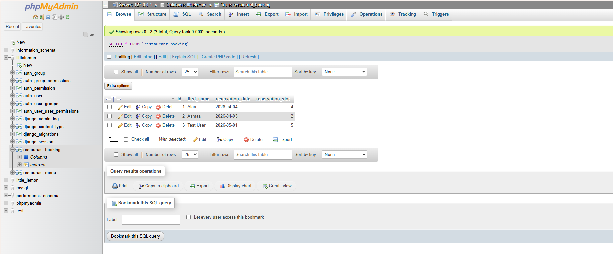
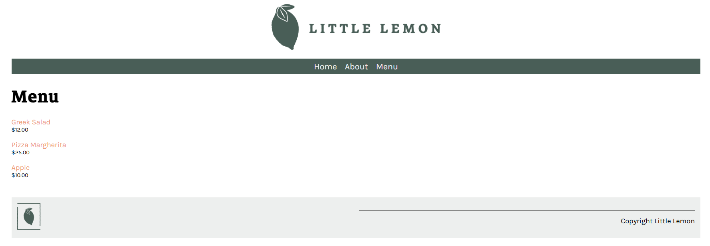
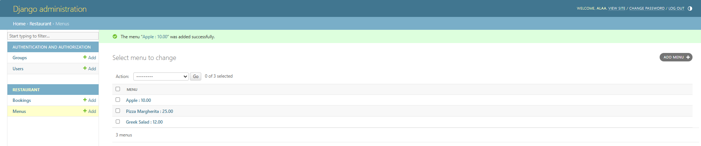
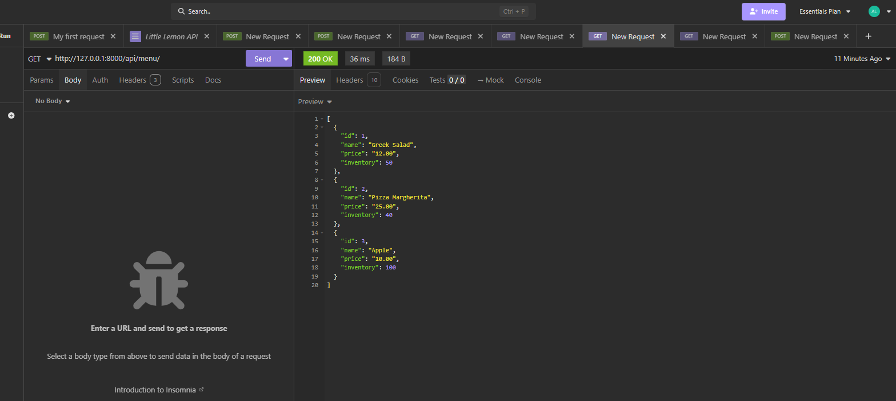
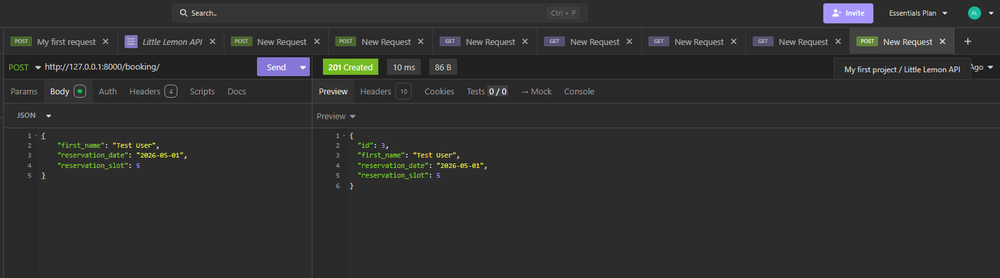

# Little Lemon Restaurant Management System

This is the final capstone project for the Meta Back-End Developer Professional Certificate. It is a full-stack web application built using **Django** and **MySQL**.

## Project Overview
Little Lemon is a modern restaurant website that allows users to view the menu and book tables online. It also features a robust API for internal and external integration.

## Features
- **Menu Management:** View, add, and update menu items via Django Admin.
- **Table Booking:** A real-time booking system that stores reservations in a MySQL database.
- **RESTful API:** Endpoints for menu items and bookings tested with Insomnia.
- **Database Integration:** Fully integrated with MySQL (via XAMPP/phpMyAdmin).

## Tech Stack
- **Framework:** Django 4.2.10
- **API Framework:** Django REST Framework
- **Database:** MySQL
- **Frontend:** HTML, CSS, JavaScript

## Installation & Setup
1. Clone the repository.
2. Create a virtual environment: `python -m venv venv`.
3. Activate the environment and install dependencies: `pip install -r requirements.txt`.
4. Run migrations: `python manage.py migrate`.
5. Start the server: `python manage.py runserver`.

## Screenshots

### 1. Database Bookings

### 2. Menu Interface

### 3. Django Admin Management

### 4. API Testing (GET Items)

### 5. API Testing (POST Booking)

